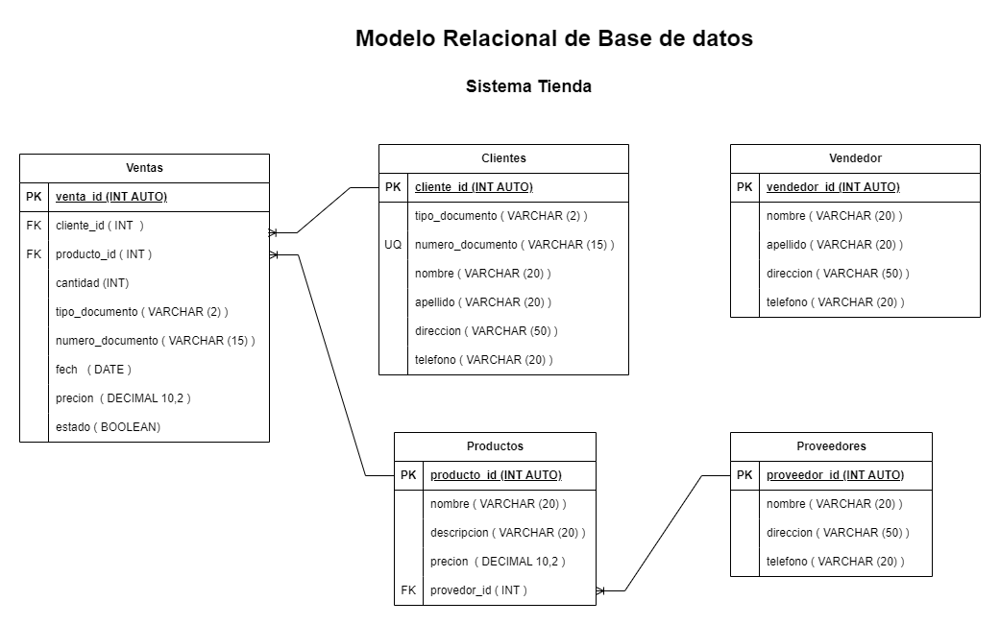

# Talleres 7: SQL: Sentencias básicas y setup - Cantera 2 - Sofka

## Tienda

## Listado de entidades

### productos  **( ED )**  <!-- Entidad de datos -->
- producto_id  **( PK )** <!-- Llave primaria -->
- nombre
- descripcion
- precio
- provedor_id  **( FK )**  <!-- Llave foranea -->

### proveedores **( ED )**  <!-- Entidad de datos -->
- proveedor_id  **( PK )** <!-- Llave primaria -->
- nombre
- direccion
- telefono

### clientes        **( ED )**  <!-- Entidad de datos -->
- cliente_id        **( PK )** <!-- Llave primaria -->
- tipo_documento    **(UQ)**  <!-- Campo unico --> 
- numero_documento  **(UQ)**  <!-- Campo unico -->
- nombre
- apellido
- direccion
- telefono

### ventas    **( ED )**  <!-- Entidad de datos -->
- ventas_id   **( PK )** <!-- Llave primaria -->
- cliente_id  **( FK )**  <!-- Llave foranea -->
- producto_id **( FK )**  <!-- Llave foranea -->
- cantidad
- fecha
- precio
- estado

### vendedor      **( ED )**  <!-- Entidad de datos -->
- vendedor_id     **( PK )** <!-- Llave primaria -->
- nombre   
- apellido   
- direccion
- telefono

## Relaciones

1. Un **proveedor** provee varios **productos**     (_1 - M_).
1. Un **cliente** pueden tener varias **Ventas**    (_1 - M_).
1. Un **producto** pueden tener varias **ventas**   (_1 - M_).

## Modelo Entidad Relacion 

## Glosario

- **PK**  _Primary Key_ 
- **FK**  _Foreing Key_ 
- **UQ**  _Unique Attribute_
- **ED**  Entida de datos 
- **EP**  Entida Pivote 
- **EC**  Entidad Catalogo 